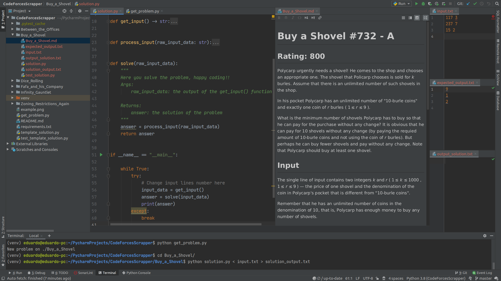

# CodeForcesScrapper

## TL;DR
Fetches a random problem from https://codeforces.com, creates a markdown description, input and output files, a python solution template and saves all of them on a brand new directory.

## FAQ
**Why do I need this?** - To easily get new problems to solve without leaving the IDE and switchig to the browser. All the information necessary is saved in the same place.

**How does it works?**
The script uses the official [api](https://codeforces.com/apiHelp) to to select a new problem within a [rank range](../master/get_problem.py#L25-L26) and then scraps the page of the problem, process a little the html to make it more readable on markdown and create the new files.

## Benefits
- Problem description integrated to the code (no more pasting in the comments).
- Automatic input and expected output files (no more copying and pasting data from the examples).
- Automatic solution template code (no more recriating the same template solution for every new problem).
- Efficiently finds and download new problems directly from the IDE.
- Automatically creates unit tests from the problem examples.

## Download & Insatall
```
git clone https://github.com/edkb/CodeForcesScrapper
pip install requirements.txt
```

## Execution
```
python get_problem.py
New problem on ./Name_of_the_Problem
cd /Name_of_the_Problem
```
### Output
New directory with the folowing template:
```
├── Name_of_the_Problem
│   ├── Name_of_the_Problem.md
│   ├── input.txt
│   ├── expected_output.txt
│   ├── output_solution.txt
│   ├── test_solution.py
│   └── solution.py
```

Read the problem from the *Name_of_the_Problem.md* .

Code your solution on the solution.py file.

Run your solution like this:
`python solution.py < input.txt > solution_output.txt`

Here you can compare if the output from your code is equal to the *expected_solution.txt*.

If everything is fine, test your code like this:
`pytest test_solution.py`

If it pass all the tests, you're ready to submit the problem.

Happy coding!

### Example


